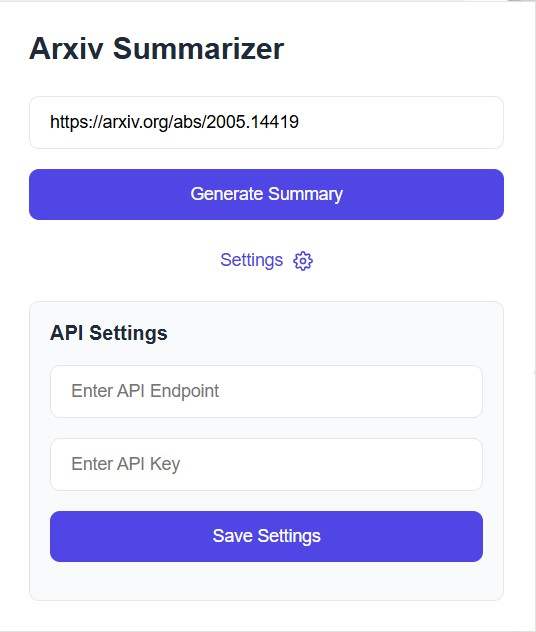
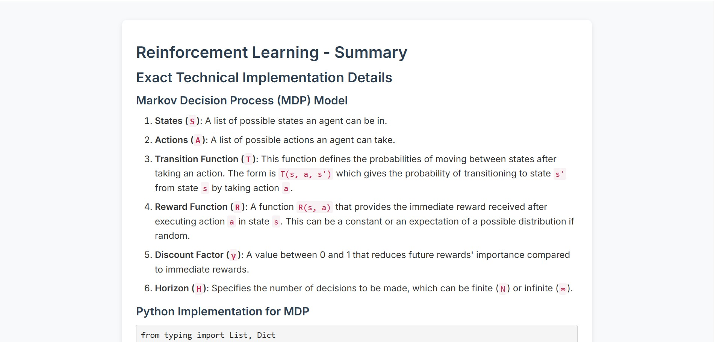

# Arxiv Summarizer

Arxiv Summarizer is a Chrome extension that allows users to quickly generate summaries of arXiv papers. When browsing an arXiv paper, users can open the extension, and the paper's URL will be automatically populated. Clicking "Generate Summary" will trigger an AWS Lambda function via API Gateway, and the summarized content will be displayed in a new tab within a minute.

## Permissions Required
To deploy this project, the following AWS permissions are required:
- **Lambda**: To create and manage AWS Lambda functions
- **API Gateway**: To create and manage API endpoints
- **S3**: To store and retrieve Lambda deployment packages
- **CloudFormation**: To automate infrastructure deployment

## Deployment Instructions

### 1. Manual Step
Add your OpenAI api key under a parameter called "prod/ArxivSummarizer/OpenAIKey" in AWS Secrets Manager.

### 2. Clone the Repository
```sh
 git clone <repo-url>
 cd <repo-folder>
```

### 3. Set Execute Permission for `deploy.sh`
```sh
chmod +x deploy.sh
```

### 4. Deploy the Infrastructure
The deployment script allows packaging, deploying, and tearing down the CloudFormation stack.

#### Package and Upload Lambda
To package and upload the Lambda function to an S3 bucket:
```sh
./deploy.sh --package -b <S3_BUCKET_NAME>
```

#### Deploy the CloudFormation Stack
To deploy the CloudFormation template:
```sh
./deploy.sh --deploy -b <S3_BUCKET_NAME>
```
After successful deployment, the script outputs:
- **API Endpoint URL**
- **API Key**

Copy these values and paste them into the **API Settings** section of the Chrome extension.

#### Tear Down the Deployment
To delete the CloudFormation stack:
```sh
./deploy.sh --teardown
```

## Using the Extension
1. Open the Chrome extension while viewing an arXiv paper.
2. The paper URL is automatically populated.
3. Click **Generate Summary**.
4. The summarized content appears in a new tab.

## Screenshots
### Extension UI


### Summary Output


---
For full example files, check the `samples` folder.

